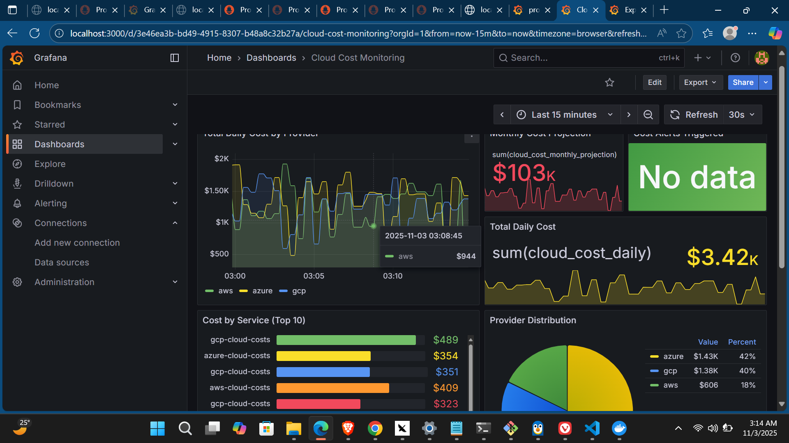

# 🦆 Production Tools - Cloud Cost Monitoring

> **Built entirely with [Goose AI](https://github.com/block/goose)** - An AI-powered development assistant

A production-ready cloud cost monitoring and secrets management system with real-time dashboards, alerts, and multi-cloud support.

[](https://www.python.org/)
[](https://www.docker.com/)
[](https://prometheus.io/)
[](https://grafana.com/)
[](LICENSE)

---

## ✨ Features

### 🎯 Cost Monitoring
- **Multi-cloud support**: AWS, Azure, GCP
- **Real-time tracking**: Live cost metrics via Prometheus
- **Beautiful dashboards**: Pre-built Grafana visualizations
- **Smart alerts**: Slack & Email notifications
- **Budget forecasting**: Monthly cost projections
- **Service breakdown**: Top 10 most expensive services

### 🔐 Secrets Management
- **Multiple backends**: HashiCorp Vault, AWS Secrets Manager, Environment Variables
- **Secret rotation**: Automated credential rotation
- **Secure storage**: Encrypted at rest
- **Access control**: Role-based permissions

### 📊 Monitoring Stack
- **Prometheus**: Time-series metrics database
- **Grafana**: Interactive dashboards
- **Docker**: One-command deployment
- **Auto-refresh**: Live data updates every 30 seconds

---

## 🚀 Quick Start

### Prerequisites
- Python 3.11+
- Docker & Docker Compose
- Cloud provider credentials (AWS/Azure/GCP)

### 1. Clone Repository
```bash
git clone https://github.com/YOUR_USERNAME/production-tools.git
cd production-tools
```

### 2. Install Dependencies
```bash
python -m venv venv
source venv/Scripts/activate  # Windows
# source venv/bin/activate     # Linux/Mac

pip install -r requirements.txt
```

### 3. Configure
```bash
cp .env.example .env
# Edit .env with your credentials

cp .cost_tracker.yaml.example ~/.cost_tracker.yaml
# Edit config file
```

### 4. Start Monitoring Stack
```bash
cd monitoring
docker-compose up -d
```

### 5. Start Metrics Exporter
```bash
python monitoring/metrics_tracker.py --port 8000 --interval 300
```

### 6. Access Dashboards
- **Grafana**: http://localhost:3000 (admin/admin)
- **Prometheus**: http://localhost:9090
- **Metrics**: http://localhost:8000/metrics

---

## 📊 Dashboard Preview



### Features Shown:
- **Real-time cost tracking** across AWS, Azure, and GCP
- **Monthly projection**: $103k estimated spend
- **Cost breakdown** by service and provider
- **Provider distribution** pie chart
- **Alert monitoring** and notification status

---

## 🔔 Notifications

The system sends alerts via Slack and Email when cost thresholds are exceeded.

### Slack Example
```
🚨 High Daily Cost Alert

Provider: AWS
Current Cost: $5,432.10
Threshold: $5,000.00
Overage: $432.10 (8.6%)
Period: Daily
Timestamp: 2025-11-03 03:14:27
```

### Configuration
```yaml
# ~/.cost_tracker.yaml
alerts:
  - name: high_daily_cost
    threshold: 1000
    notification_channels: [slack, email]

slack:
  enabled: true
  webhook_url: ${SLACK_WEBHOOK_URL}
  channel: "#cost-alerts"

email:
  enabled: true
  to_emails:
    - finance@company.com
```

---

## 📚 Documentation

- [Setup Guide](docs/setup.md) - Detailed installation instructions
- [Usage Guide](docs/usage.md) - How to use all features
- [Monitoring Guide](docs/monitoring.md) - Dashboard configuration
- [API Reference](docs/api.md) - Python API documentation
- [Troubleshooting](docs/troubleshooting.md) - Common issues and solutions

---

## 🦆 Built with Goose

This entire project was built using [Goose AI](https://github.com/block/goose), an AI-powered development assistant. 

**What Goose helped build:**
- ✅ Complete architecture design
- ✅ Multi-cloud integration code
- ✅ Prometheus metrics exporter
- ✅ Grafana dashboard JSON
- ✅ Docker deployment setup
- ✅ Comprehensive documentation
- ✅ Test suite and examples

**Development time:** ~4 hours (vs. weeks manually!)

---

## 🤝 Contributin

### 1. Bug Reports

**Before submitting:**
- Check [existing issues](https://github.com/yourusername/production-tools/issues)
- Try the latest version
- Check [troubleshooting guide](docs/troubleshooting.md)

**Issue template:**
```markdown
**Description:**
Brief description of the bug

**Steps to Reproduce:**
1. Step 1
2. Step 2
3. Step 3

**Expected Behavior:**
What should happen

**Actual Behavior:**
What actually happens

**Environment:**
- OS: Windows 11 / macOS 14 / Ubuntu 22.04
- Python: 3.11.0
- Docker: 24.0.0

**Logs:**
```
Paste relevant logs here
```
```

### 2. Feature Requests

**Issue template:**
```markdown
**Feature Description:**
What feature would you like?

**Use Case:**
Why is this feature needed?

**Proposed Solution:**
How might this work?

**Alternatives Considered:**
Other approaches you've thought about
```

### 3. Pull Requests

**Before submitting:**
- Fork the repository
- Create a feature branch
- Write tests
- Update documentation
- Run linters

---

## 🛠️ Development Setup

### 1. Fork and Clone

```bash
# Fork on GitHub, then clone
git clone https://github.com/YOUR_USERNAME/production-tools.git
cd production-tools

# Add upstream
git remote add upstream https://github.com/ORIGINAL_OWNER/production-tools.git
```

### 2. Create Virtual Environment

```bash
# Create venv
python -m venv venv

# Activate
source venv/Scripts/activate  # Windows
# source venv/bin/activate     # Linux/Mac

# Install dependencies
pip install -r requirements.txt
pip install -r requirements-dev.txt
```

### 3. Install Pre-commit Hooks

```bash
pre-commit install
```

---

## 💻 Development Workflow

### 1. Create Feature Branch

```bash
git checkout -b feature/add-digitalocean-support
```

### 2. Make Changes

**Code style:**
- Follow PEP 8
- Use type hints
- Write docstrings
- Add logging

**Example:**
```python
def fetch_costs(self, provider: str) -> List[CostMetric]:
    """
    Fetch costs from cloud provider.
    
    Args:
        provider: Provider name (aws, azure, gcp)
        
    Returns:
        List of cost metrics
        
    Raises:
        ValueError: If provider not supported
        ConnectionError: If API request fails
    """
    logger.info(f"Fetching costs from {provider}")
    
    try:
        # Implementation
        pass
    except Exception as e:
        logger.error(f"Failed to fetch costs: {e}")
        raise
```

### 3. Write Tests

```python
# tests/test_cost_tracker.py
import pytest
from monitoring.cost_tracker import CostTracker, CostMetric

def test_fetch_aws_costs():
    """Test AWS cost fetching"""
    tracker = CostTracker({'providers': {'aws': {'enabled': True}}})
    metrics = tracker.fetch_aws()
    
    assert isinstance(metrics, list)
    assert all(isinstance(m, CostMetric) for m in metrics)
    assert all(m.provider == 'aws' for m in metrics)

def test_alert_threshold():
    """Test cost alert triggers"""
    tracker = CostTracker({
        'alerts': [
            {'threshold': 100, 'period': 'daily', 'notification_channels': ['slack']}
        ]
    })
    
    analysis = {'total_cost': 150}
    alerts = tracker.check_alerts(analysis)
    
    assert len(alerts) == 1
    assert alerts[0]['actual'] == 150
```

### 4. Run Tests

```bash
# Run all tests
pytest

# With coverage
pytest --cov=. --cov-report=html

# Specific test file
pytest tests/test_cost_tracker.py -v

# With logs
pytest -v -s
```

### 5. Run Linters

```bash
# Black (code formatting)
black .

# Flake8 (linting)
flake8 .

# MyPy (type checking)
mypy .

# isort (import sorting)
isort .
```

### 6. Update Documentation

```bash
# If adding new feature, update:
- README.md (features section)
- docs/usage.md (usage examples)
- docs/api.md (API reference)
- CHANGELOG.md (unreleased section)
```

### 7. Commit Changes

```bash
# Stage changes
git add .

# Commit with conventional commit message
git commit -m "feat: add DigitalOcean cost tracking"
```

**Commit message format:**
```
type(scope): subject

body (optional)

footer (optional)
```

**Types:**
- `feat`: New feature
- `fix`: Bug fix
- `docs`: Documentation
- `style`: Formatting
- `refactor`: Code restructure
- `test`: Tests
- `chore`: Maintenance

**Examples:**
```
feat(monitoring): add DigitalOcean provider support
fix(security): handle vault connection timeout
docs(api): add examples for metrics exporter
test(cost-tracker): add unit tests for AWS fetching
refactor(deployment): simplify health check logic
```

### 8. Push and Create PR

```bash
# Push to your fork
git push origin feature/add-digitalocean-support

# Create PR on GitHub
# Use PR template
```

**PR template:**
```markdown
## Description
Brief description of changes

## Type of Change
- [ ] Bug fix
- [ ] New feature
- [ ] Breaking change
- [ ] Documentation update

## Testing
- [ ] Tests pass locally
- [ ] Added new tests
- [ ] Updated documentation

## Checklist
- [ ] Code follows style guidelines
- [ ] Self-review completed
- [ ] Comments added for complex code
- [ ] Documentation updated
- [ ] No new warnings generated
- [ ] Tests added/updated
```

---

## 🧪 Testing Guidelines

### Unit Tests

**Location:** `tests/`

**Naming:** `test_<module>.py`

**Coverage:** Aim for >80%

**Example:**
```python
def test_secret_rotation():
    """Test secret rotation functionality"""
    sm = SecretsManager(backend='vault')
    
    # Store initial secret
    sm.put_secret('test-key', {'password': 'old'})
    
    # Rotate
    sm.rotate_secret('test-key', {'password': 'new'})
    
    # Verify
    secret = sm.get_secret('test-key')
    assert secret['password'] == 'new'
```

### Integration Tests

```python
@pytest.mark.integration
def test_cost_tracker_with_real_aws():
    """Test with real AWS API (requires credentials)"""
    if not os.getenv('AWS_ACCESS_KEY_ID'):
        pytest.skip("AWS credentials not configured")
    
    tracker = CostTracker({'providers': {'aws': {'enabled': True}}})
    metrics = tracker.fetch_aws()
    
    assert len(metrics) > 0
```

### Run integration tests:
```bash
pytest -m integration
```

---

## 📚 Documentation Guidelines

### Code Documentation

**Docstrings:**
```python
def calculate_monthly_projection(daily_cost: float, days: int = 30) -> float:
    """
    Calculate projected monthly cost from daily cost.
    
    Args:
        daily_cost: Average daily cost in USD
        days: Number of days to project (default: 30)
        
    Returns:
        Projected monthly cost in USD
        
    Example:
        >>> calculate_monthly_projection(100.50)
        3015.00
    """
    return daily_cost * days
```

**Comments:**
```python
# Calculate cost per service (group by service name)
service_costs = {}
for metric in metrics:
    # Skip zero-cost services
    if metric.cost == 0:
        continue
    
    # Aggregate by service
    if metric.service not in service_costs:
        service_costs[metric.service] = 0
    service_costs[metric.service] += metric.cost
```

### Markdown Documentation

**Sections:**
- Title (H1)
- Table of Contents
- Quick Start
- Detailed Usage
- Examples
- Troubleshooting
- References

**Code blocks:**
````markdown
```python
# Python code
def example():
    pass
```

```bash
# Shell commands
python script.py --help
```